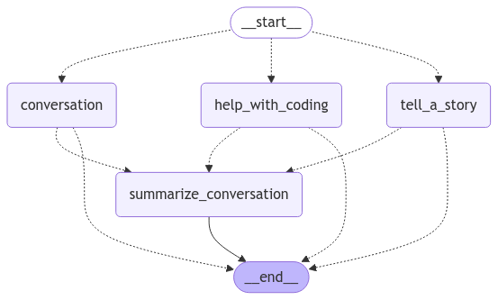

# Miss Fritters

Miss Fritters is currently a test of LLMs using Ollama and Coqui TTS.

## Installation

- Download Ollama - https://ollama.com/blog/llama3
- Run the LLMs you wish to using Ollama. 
  - For all the models I use:
    - Run ./modelfiles/run.bat for Windows users.
    - Run the individual modelfiles using Ollama.
- Use the package manager [pip](https://pip.pypa.io/en/stable/) to install any dependencies using the requirements.txt file (pip install -r requirements.txt)
- If you want to use the Simple TTS, just use the SimpleStuffSayer in main.py.
- If you want to use Advanced TTS instead of the simple, it requires a bit more setup...
  - For Windows, it also requires build tools. Go [here](https://visualstudio.microsoft.com/visual-cpp-build-tools/), Check Desktop development with C++, then install

## Use

There are three uses at the moment:

- main_discord: Uses a Discord app, only requires a config.json file in the root directory with a valid token in a discord_bot_token key.
  - Has \$join, \$ask, and \$leave commands to have it join a Discord call and use TTS.
  - Images work, but at the moment you will need to indicate to the bot the file by name.
- main_cli: Your standard command-line in a loop.
- main_stt: An endless loop of listening for user input via voice and responding.

## Current State:

- Miss Fritters uses these LLMs:
  - Llama3.2 for chatting
  - Mistral for telling a story.
  - CodeLlama for helping with coding.
- Has persistent conversation history by default (delete chat_history.db to reset it)
- Has an InMemory store for specific memories. Has two tools to add and retrieve memories respectively.
- Can search the internet using DuckDuckGo for free, but you might get throttled.
- A bunch of other random tools like rolling dice and drawing cards.

## How does this work?

- Learning about Edges is important for this - [Check it out here](https://langchain-ai.github.io/langgraph/concepts/low_level/#edges)
- Look at miss_fritters.py and read the code as you follow along.

# Mermaid Diagram
- 

There are 6 nodes:

- The Start node - "supervisor_routing"
    - The Supervisor which uses Llama3.2 (see the supervisor_routing function)
    - Determines whether the prompt given is about coding, storytelling, or
      conversation (default)
- The Conversation node - "conversation"
  - Uses Llama3.2 wrapped in a react agent to respond
  - Has a simple tool to roll dice that it can use
- The Coding node - "help_with_coding"
  - Uses CodeLlama to respond to the prompt
  - CodeLlama has been instructed to help with the coding prompt
- The Story node - "tell_a_story"
  - Uses Mistral to respond to the prompt
  - Mistral has been instructed to tell a story based on the prompt
- The Summarize Conversation Node - "summarize_conversation"
  - Uses Llama3.2 to summarize the current conversation and store it into memory.
  - Deletes all but the last message.
- The End node - Just ends.

Coding example with no summary flow:
- The user asks "How do I print the numbers 1 to 10 in Python?"
- The prompt goes to the Start node
  - Is a conditional edge, meaning that it will respond with the name of another node to send the prompt to.
  - In this case, the supervisor returns "help_with_coding"
- The prompt then goes to the Coding node
  - The prompt is processed by the llm in the node and returns the result
- The number of messages is checked
  - Since it is six or less, it goes to the End node.
- This then moves to the End node, ending the graph.
- The user gets their response.

Conversation example flow:
- The user asks "How are you doing today?"
- The prompt goes to the Start node
  - Is a conditional edge, meaning that it will respond with the name of another node to send the prompt to.
  - In this case, the supervisor returns "conversation" as the prompt does not seem to be about storytelling or coding.
- The prompt then goes to the Conversation node
  - The prompt is processed by the llm in the node and returns the result
- The number of messages is checked
  - Since it is greater than six, it goes to the Conversation Summary node.
- The prompt then goes to the Conversation Summary node
  - This node summarizes the conversation and puts it into the store
  - It then deletes all messages except the response to the user.
  - This then moves to the End node, ending the graph.
- The user gets their response.